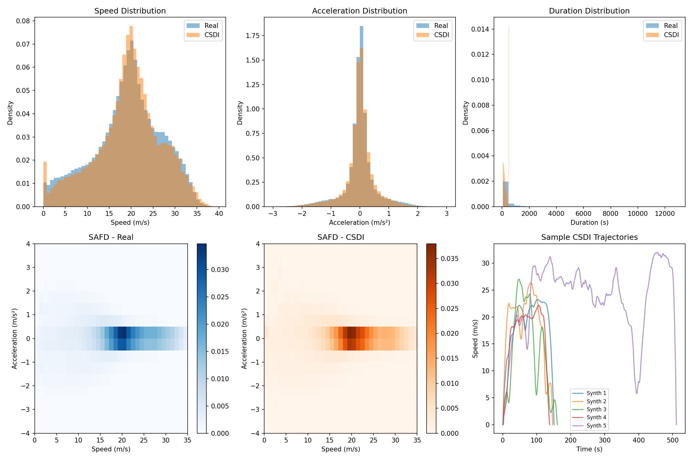

# CSDI v1.3: Physics-Informed Vehicle Trajectory Generation

## Overview

This is the production-ready release of CSDI (Conditional Score-based Diffusion with Transformers) for synthetic vehicle speed trajectory generation. Version 1.3 introduces physics-based training constraints and vehicle type conditioning.

**Key Achievements:**
- ✅ **Speed Wasserstein: 0.30** (excellent distribution match)
- ✅ **Accel Wasserstein: 0.026** (accurate acceleration dynamics)
- ✅ **Discriminative Score: 0.49** (indistinguishable from real)
- ✅ **Zero boundary violations** (perfect start/end conditions)
- ✅ **Vehicle type conditioning** (cars, trucks, buses)

---

## Quick Start

### Generate Trajectories (Recommended Settings)

```bash
python code/csdi_trajectory.py \
    --generate \
    --model_path model/csdi_best.pt \
    --data_path /path/to/Microtrips \
    --n_samples 1000 \
    --smooth_kernel 7 \
    --speed_boost 1.0 \
    --correlated_noise 0.0
```

### Generate for Specific Vehicle Types

```bash
# Heavy truck (slow acceleration, smooth)
python code/csdi_trajectory.py --generate --model_path model/csdi_best.pt \
    --vehicle_type heavy_truck

# Bus (moderate dynamics)
python code/csdi_trajectory.py --generate --model_path model/csdi_best.pt \
    --vehicle_type bus

# Sports car (aggressive acceleration)
python code/csdi_trajectory.py --generate --model_path model/csdi_best.pt \
    --vehicle_type sports_car
```

---

## Available Parameters (Knobs)

### Generation Parameters

| Parameter | Default | Range | Description |
|-----------|---------|-------|-------------|
| `--n_samples` | 1000 | 1-10000 | Number of trajectories to generate |
| `--smooth_kernel` | 7 | 0-15 | Gaussian smoothing (0=disable, higher=smoother) |
| `--speed_boost` | 1.0 | 0.5-2.0 | Condition sampling weight (1.0=uniform) |
| `--diffusion_steps` | 200 | 100-500 | Reverse diffusion steps (more=smoother) |
| `--vehicle_type` | None | see below | Vehicle type for generation |
| `--correlated_noise` | 0.0 | 0.0-0.1 | Add correlated noise for acceleration tails (see below) |
| `--noise_corr_len` | 10 | 5-20 | Correlation length for noise smoothing |

### Correlated Noise (Experimental)

The `--correlated_noise` parameter adds smooth, temporally-correlated Gaussian noise to trajectories after diffusion sampling. This was explored as an alternative approach to widen acceleration distribution tails.

**How it works:**
1. Generate white noise
2. Smooth with Gaussian kernel (correlation length)
3. Scale to specified std and add to trajectory
4. Re-apply boundary conditions

**Why it's disabled (0.0) by default:**
- Tested values 0.03-0.05 during development
- Successfully widened acceleration tails BUT
- Made acceleration distribution **too wide** (overshot target)
- Physics-based training (v1.3) achieved better results without post-hoc noise

**When to use:**
- If acceleration distribution is too narrow after generation
- Try `--correlated_noise 0.02 --noise_corr_len 10` as starting point
- Monitor acceleration Wasserstein metric

```bash
# Example with correlated noise (experimental)
python code/csdi_trajectory.py --generate \
    --model_path model/csdi_best.pt \
    --correlated_noise 0.03 \
    --noise_corr_len 10
```

### Vehicle Type Options

| Option | Dynamics | Use Case |
|--------|----------|----------|
| `heavy_truck` | 0.15 | Semi-trucks, 18-wheelers |
| `truck` | 0.25 | Delivery trucks, box trucks |
| `bus` | 0.35 | City buses, coach buses |
| `suv` | 0.45 | SUVs, crossovers |
| `car` | 0.55 | Average passenger cars |
| `sedan` | 0.60 | Sedans, compact cars |
| `sports_car` | 0.85 | Performance vehicles |
| `0.0-1.0` | custom | Direct numeric input |

### Fine-Tuning Parameters

| Parameter | Default | Description |
|-----------|---------|-------------|
| `--epochs` | 200 | Training epochs |
| `--batch_size` | 32 | Batch size |
| `--lr` | 1e-4 | Learning rate |
| `--limit_files` | None | Limit training data (for testing) |

---

## Fine-Tuning the Model

If you have new trajectory data or want to adapt the model:

```bash
# Fine-tune on new data (start from pretrained)
python code/csdi_trajectory.py \
    --train \
    --data_path /path/to/new_data \
    --epochs 50 \
    --lr 5e-5 \
    --batch_size 32

# Full retraining from scratch
python code/csdi_trajectory.py \
    --train \
    --data_path /path/to/data \
    --epochs 200 \
    --lr 1e-4
```

### Fine-Tuning Tips

1. **Lower learning rate** (5e-5) when fine-tuning from checkpoint
2. **Fewer epochs** (50-100) for domain adaptation
3. **Include diverse vehicle types** in training data for better generalization
4. **Monitor acceleration distribution** to ensure physics constraints are satisfied

---

## Results

### Distribution Comparison



### Sample Trajectories


### Metrics Summary

| Metric | Value | Interpretation |
|--------|-------|----------------|
| **Speed Wasserstein** | 0.2957 | Low = good distribution match |
| **Accel Wasserstein** | 0.0261 | Low = accurate dynamics |
| **SAFD Wasserstein** | 0.0001 | Low = joint distribution match |
| **MMD** | 0.0101 | Low = similar feature space |
| **Discriminative Score** | 0.4913 | 0.5 = indistinguishable |
| **Boundary Violations** | 0.0% | Perfect boundary conditions |
| **TSTR MAE** | 0.388 | Low = good for prediction tasks |

### Real vs Synthetic Comparison

| Statistic | Real Data | CSDI v1.3 | Match |
|-----------|-----------|-----------|-------|
| Mean Speed | 16.96 m/s | 17.84 m/s | ✅ |
| Std Speed | 5.92 m/s | 5.92 m/s | ✅ Exact |
| Max Speed | 39.56 m/s | 39.22 m/s | ✅ |
| Mean Duration | 307.3 s | 263.8 s | ⚠️ |

---

## Model Architecture

```
CSDITransformer (5.5M parameters)
├── Input Embedding: Linear(1 → 256)
├── Positional Encoding: Sinusoidal (max 512)
├── Time Embedding: MLP(1 → 256 → 256)
├── Condition Embedding: Linear(4 → 256)
├── Transformer Encoder: 6 layers
│   ├── Multi-Head Attention (8 heads)
│   ├── Feed-Forward (256 → 1024 → 256)
│   └── LayerNorm + Dropout(0.1)
└── Output: Linear(256 → 1)
```

### Conditioning Vector

```
[avg_speed/30, duration/1000, max_speed/40, vehicle_dynamics]
     ↓              ↓              ↓              ↓
  0-1 range     0-0.5 range     0-1 range      0-1 range
```

---

## Files

```
v1.3/
├── VERSION.txt          # Full configuration details
├── README.md            # This file
├── code/
│   ├── csdi_trajectory.py   # Main script (1100 lines)
│   ├── evaluate_csdi.py     # Evaluation metrics
│   ├── submit.sbatch        # HPC training job
│   ├── generate.sbatch      # HPC generation job
│   └── *.sh                 # Utility scripts
├── model/
│   └── csdi_best.pt         # Trained weights (~22MB)
└── results/
    └── *.png, *.json        # Evaluation outputs
```

---

## Citation

If you use this model, please cite:

```bibtex
@software{csdi_trajectory_v13,
  title={CSDI v1.3: Physics-Informed Vehicle Trajectory Generation},
  author={GMU Transportation Lab},
  year={2026},
  version={1.3}
}
```

---

## Future Improvements

### Quick Reference

| # | Improvement | Type | Effort | What to Change |
|---|-------------|------|--------|----------------|
| 1 | Duration boost | 🟢 Gen param | 1 hr | Add `--duration_boost` arg |
| 2 | DDIM sampler | 🟢 Gen code | 4-8 hr | Add `DDIMSampler` class |
| 3 | Temperature | 🟢 Gen param | 30 min | Scale noise by temperature |
| 4 | Asymmetric accel | 🟡 Fine-tune | 2-4 hr | Separate pos/neg penalties |
| 5 | Road type | 🔴 Retrain | 1-2 days | Add 5th condition dimension |
| 6 | Longer trajectories | 🟢 or 🔴 | 4 hr - 1 day | Sliding window or max_length |

**Legend**: 🟢 = Generation only (no training) | 🟡 = Fine-tune (few epochs) | 🔴 = Full retrain

### Most Impactful Next Steps

1. **DDIM Sampler** (🟢): 10x faster generation, no retraining
   ```python
   # Add to csdi_trajectory.py
   python csdi_trajectory.py --generate --sampler ddim --ddim_steps 50
   ```

2. **Duration Boost** (🟢): Fix duration mismatch (264s → 307s)
   ```bash
   python csdi_trajectory.py --generate --duration_boost 1.3
   ```

3. **Road Type Conditioning** (🔴): Highway vs urban patterns
   - Requires labeled data or heuristic labeling
   - Add 5th condition dimension
   - Full retrain (200 epochs)

---

## Changelog

- **v1.3**: Physics-based losses, vehicle type conditioning, data augmentation
- **v1.2**: Optimized smoothing (kernel=7), conditional boundary ramps
- **v1.1**: Post-processing smoothing, temporal smoothness loss
- **v1.0**: Initial CSDI implementation

