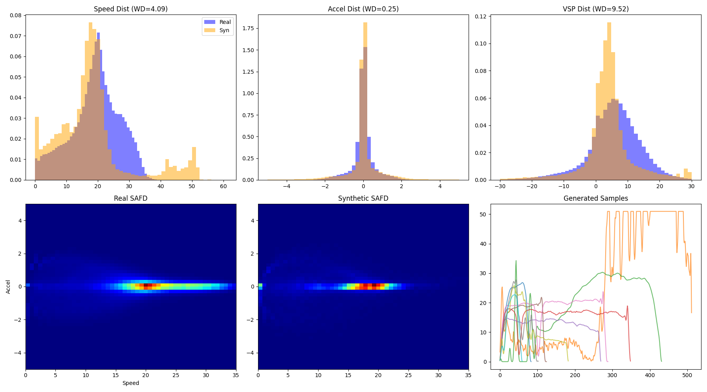

# Physics-Informed Diffusion for Vehicle Trajectories (Model & Results)

This document details the modeling pipeline, including architecture, training objectives, physics-informed constraints, and evaluation results.

---

## 1. Model Architecture: Conditional 1D U-Net

The core generative model is a 1D U-Net that denoises random Gaussian noise into vehicle speed trajectories.

*   **Inputs:** `(Batch, 2, 512)` tensor representing [Speed, Acceleration].
*   **Conditioning:** Target average speed ($\bar{v}$) and trip duration ($T$). These are injected via **FiLM (Feature-wise Linear Modulation)** layers at each residual block.
*   **Backbone:**
    *   **Time Embeddings:** Sinusoidal positional embeddings (dim=256).
    *   **Downsampling:** 4 layers `[256, 512, 1024, 1024]` with ResNet blocks.
    *   **Attention:** Self-attention at lower resolutions.

$$ \epsilon_\theta(x_t, t, c) \rightarrow \text{Predicted Noise} $$

---

## 2. Training Pipelines

### A. Standard Diffusion (Baseline v1.0)
Optimizes the standard Variational Lower Bound (VLB) simplified to MSE on noise:
$$ L_{\text{simple}} = \mathbb{E}_{t, x_0, \epsilon} \left[ \| \epsilon - \epsilon_\theta(x_t, t, c) \|^2 \right] $$

### B. Physics-Informed Diffusion (PID v1.1)
Adds regularization terms to the loss function to enforce physical plausibility directly during training:
$$ L_{total} = L_{\text{simple}} + \lambda_1 L_{dist} + \lambda_2 L_{asym} + \lambda_3 L_{jerk} + \lambda_4 L_{boundary} $$

*   $L_{dist}$: Enforces $\int v dt = \text{Target Distance}$.
*   $L_{asym}$: Penalizes braking ($a < -4.5$) more than acceleration.
*   $L_{boundary}$: Forces $v_{start} = v_{end} = 0$.

---

## 3. Generation & Inpainting

We use **Classifier-Free Guidance (CFG)** with **Physics-Informed Inpainting** to control the generation.

### Sampling Logic
1.  **Inverse Diffusion:** $x_{t-1} = \frac{1}{\sqrt{\alpha_t}} (x_t - \frac{1-\alpha_t}{\sqrt{1-\bar{\alpha}_t}} \epsilon_\theta(x_t, t, c)) + \sigma_t z$
2.  **Inpainting:** At each step $t$, we strictly enforce boundary conditions by fusing the noisy known state with the predicted state:
    $$ x_{t-1} = x_{t-1} \cdot (1 - M) + x_{t-1}^{\text{known}} \cdot M $$
    Where $M$ is a binary mask (1 at start/end indices).

### Post-Processing (v1.0)
To correct minor drift, verification applies:
1.  **Tail Stretching:** Smoothly interpolates the end of the trip to zero speed at the exact duration.
2.  **Global Scaling:** $v_{new} = v_{raw} \cdot \frac{\text{Target Dist}}{\text{Actual Dist}}$.

---

## 4. Results & Comparison

We evaluated two main versions of the model against the CMAP real-world dataset.

### A. Model Versions
*   **v1.0 (Baseline):** Standard training + Advanced Post-Processing. **(Recommended)**
*   **v1.1 (PID):** Experimental training with physics constraints.

### B. Comparative Metrics
**Metric Key:**
*   **WD:** Wasserstein Distance (Lower is Better).
*   **Discriminative Score:** 0.5 = Indistinguishable from real (Best), 0.0 or 1.0 = Easily distinguished.

| Metric | v1.0 (Baseline) | v1.1 (PID) | Status |
| :--- | :--- | :--- | :--- |
| **Boundary Violation** | **0.00%** | **100.00%** | ❌ Critical |
| **WD Speed** | **1.6029** | 4.4044 | ❌ Regressed |
| **WD Accel** | **0.0284** | 0.2545 | ❌ 10x Worse |
| **Discriminative Score** | **0.1067** | 0.4767 | ❌ Poor Realism |
| **MMD** | **0.0105** | 0.0121 | ⚠️ Slight Degradation |
| **WD VSP** | **1.0129** | 9.6036 | ❌ Major Mismatch |
| **Max Speed** | 37.44 m/s | 60.97 m/s | ⚠️ Unrealistic |
| **TSTR MAE** | **0.3051** | 0.7367 | ❌ Lower Utility |

### C. Visual Analysis

#### v1.0 (Baseline)
Smooth, physically valid trajectories that match the real distribution.

#### v1.1 (PID)
Shows high-frequency noise, unrealistic speeds (>60 m/s), and fails to stop at the end.

---

## 5. Conclusion
The **v1.0 Baseline** is the definitive model for this project. The PID approach (v1.1) introduced instability and regression, likely due to optimization conflicts between the diffusion loss and the stiff physics constraints.
