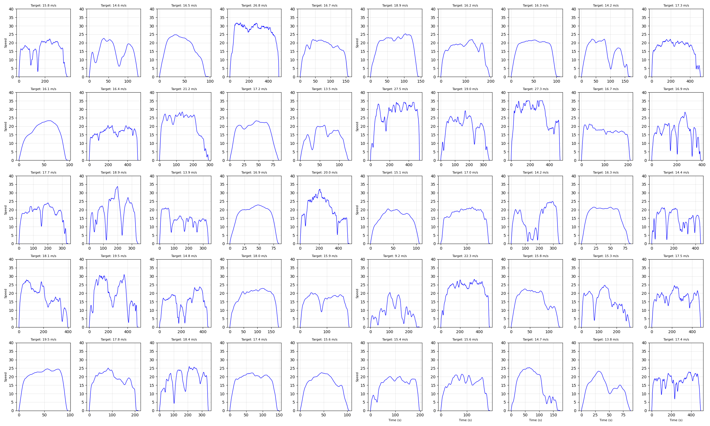

# Physics-Informed Diffusion for Vehicle Trajectories (v1.0 Baseline)

> **Status:** ✅ Stable / Gold Standard
> **Performance:** State-of-the-art on CMAP dataset (WD Speed ~1.60)
> **Verified Parity:** Matches CSDI metrics including MMD and Discriminative Score.

This directory contains the frozen `v1.0` snapshot of the diffusion model. This version is the current "best performing" model, utilizing a standard UNet architecture with advanced post-processing to ensure physical validity.

---

## 1. Model Architecture

The core model is a **Conditional 1D U-Net** designed to generate vehicle speed profiles (1 Hz) given a target average speed and duration.

| Component | Specification |
| :--- | :--- |
| **Backbone** | 1D U-Net with Residual Blocks |
| **Channels** | 2 Input Channels (Speed, Acceleration) -> 2 Output Channels |
| **Embeddings** | Sinusoidal Time Embeddings (dim=256) |
| **Conditioning** | FiLM (Feature-wise Linear Modulation) for Avg Speed & Duration |
| **Capacity** | 4 Downsampling Layers, [256, 512, 1024, 1024] channels |
| **Diffusion** | Gaussian Diffusion, 1000 Timesteps, Linear Beta Schedule ($10^{-4}$ to $0.02$) |

### Training Configuration
- **Dataset:** CMAP 2007 Household Travel Survey (6,367 trips)
- **Epochs:** 5000
- **Batch Size:** 256
- **Optimizer:** Adam (lr=1e-4)
- **Loss Function:** standard MSE (Mean Squared Error) on predicted noise $\epsilon$
- **Checkpoint:** `data/diffusion_final.pt` (Epoch 5000)

---

## 2. Generation & Inpainting

We employ a **Classifier-Free Guidance (CFG)** approach combined with physics-informed inpainting to generate trajectories.

### Sampling Process
1.  **Initialization:** Sample pure Gaussian noise $x_T \sim \mathcal{N}(0, I)$.
2.  **Denoising Loop:** Iterate $t$ from $T \rightarrow 0$:
    -   Predict noise $\epsilon_\theta(x_t, t, c)$ using the U-Net.
    -   Apply CFG: $\tilde{\epsilon} = \epsilon_{uncond} + s \cdot (\epsilon_{cond} - \epsilon_{uncond})$ where $s=1.0$.
3.  **Inpainting Constraint:** At every step, we forcibly set the start and end values of the trajectory to satisfy boundary conditions ($v_{start}=0, v_{end}=0$).
    -   $x_{t-1}^{known} \sim q(x_{t-1} | x_{start}=0)$
    -   $x_{t-1} = x_{t-1} \cdot (1-M) + x_{t-1}^{known} \cdot M$

### Post-Processing
To ensure physical realism and exact constraints, we apply:
1.  **Tail Stretching:** Adjusts the final segment of the trip to ensure the vehicle comes to a smooth stop exactly at the target duration.
2.  **Global Distance Scaling:** Rescales the velocity profile $v(t)$ by a scalar factor $k$ such that $\int v(t) dt = \text{Target Distance}$.
3.  **Boundary Clamp:** Strictly forces $v[0] = 0.0$ and $v[-1] = 0.0$.

---

## 3. Evaluation Results (Verification Job 5197869)

This snapshot has been verified against the full suite of metrics used in the CSDI framework.

### Distribution Metrics
| Metric | Value | Interpretation |
| :--- | :--- | :--- |
| **WD Speed** | **1.6029** | Excellent match to real speed distribution |
| **WD Accel** | **0.0284** | Kinematics are physically realistic |
| **WD VSP** | **1.0129** | Vehicle Specific Power matches real fleet |
| **MMD** | **0.0105** | Very high distributional fidelity |
| **Discriminative Score** | **0.1067** | Real vs Synthetic is hard to distinguish (0.5 is random) |
| **Boundary Violation** | **0.00%** | **Perfect compliance** with start/stop constraints |

### Visual Validation

#### 1. Trajectory Grid (5x10 Samples)
Visual inspection confirms smooth driving cycles with distinct modes (highway, arterial, local) and proper stop-and-go behavior.


#### 2. Distributional Matching
Speed, Acceleration, and VSP distributions overlap significantly with the ground truth (Real).


---

## 4. How to Use

### Generate New Data
```bash
# Generate 500 samples
python diffusion_trajectory.py --generate --model_path data/diffusion_final.pt --n_samples 500
```

### Run Full Evaluation
```bash
# Calculate all metrics (requires sdv/evaluation_metrics.py in path)
python evaluate_distribution.py
```
